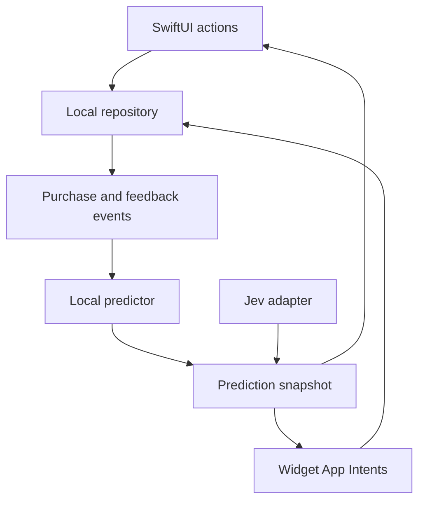

# Architecture sketch

## Targets and modules

- **iPhone app:** SwiftUI views and actions.
- **Shared core:** domain models, repository protocol, prediction engine, event corrections, widget snapshot builder.
- **Widget extension:** reads a small shared snapshot and invokes App Intents to write actions through shared storage.
- **Jev adapter:** optional HTTP client behind a protocol; deterministic prediction remains the offline path.

Start with a local store and an App Group shared container for widget access. Choose SwiftData versus a small SQLite/store implementation in the first implementation issue after testing extension reads and App Intent writes on a device. Avoid assuming the widget can directly share an app process or live bindings. CloudKit sharing needs a separate two-device spike before committing to a persistence choice.

## Event-oriented domain

| Entity | Key fields | Purpose |
| --- | --- | --- |
| Product | stable ID, display name, normalized name, default quantity | Household identity and autocomplete |
| ListEntry | ID, product ID, quantity, origin, createdAt, status | Active user-owned shopping intent |
| PurchaseEvent | ID, product ID, quantity, purchasedAt, source entry ID | Immutable-ish learning signal; corrections remain possible |
| SuggestionFeedback | ID, product ID, action, timestamp, snoozeUntil | Accept/defer/dismiss outcome |
| PredictionSnapshot | product ID, score, tier, quantity, generatedAt, source | Derived cache for app and widget; never source of truth |

Use stable identifiers and explicit timestamps. For a mistaken check-off, reverse or delete the corresponding event and restore the list entry; rederive predictions. Avoid merging separate purchases on the same day without an explicit rule. Make actions idempotent by event ID so widget and app interactions cannot double record.

## Data flow

The diagram describes logical flow, not direct synchronous calls across processes. Persist a widget-readable snapshot in the App Group and request a timeline reload after changes. Refresh predictions when app opens, after purchase/feedback changes and at a conservative scheduled interval; widgets display the most recent safe snapshot.

## Sharing branch

For a shared household, decide who owns product identity and event writes, how household membership is established, and how CloudKit private/shared databases map to local persistence. Prototype simultaneous additions, duplicate names, offline purchases, and corrections on two devices. A single-user local app is the first usable slice. No personal purchase data or Jev key goes in git.
