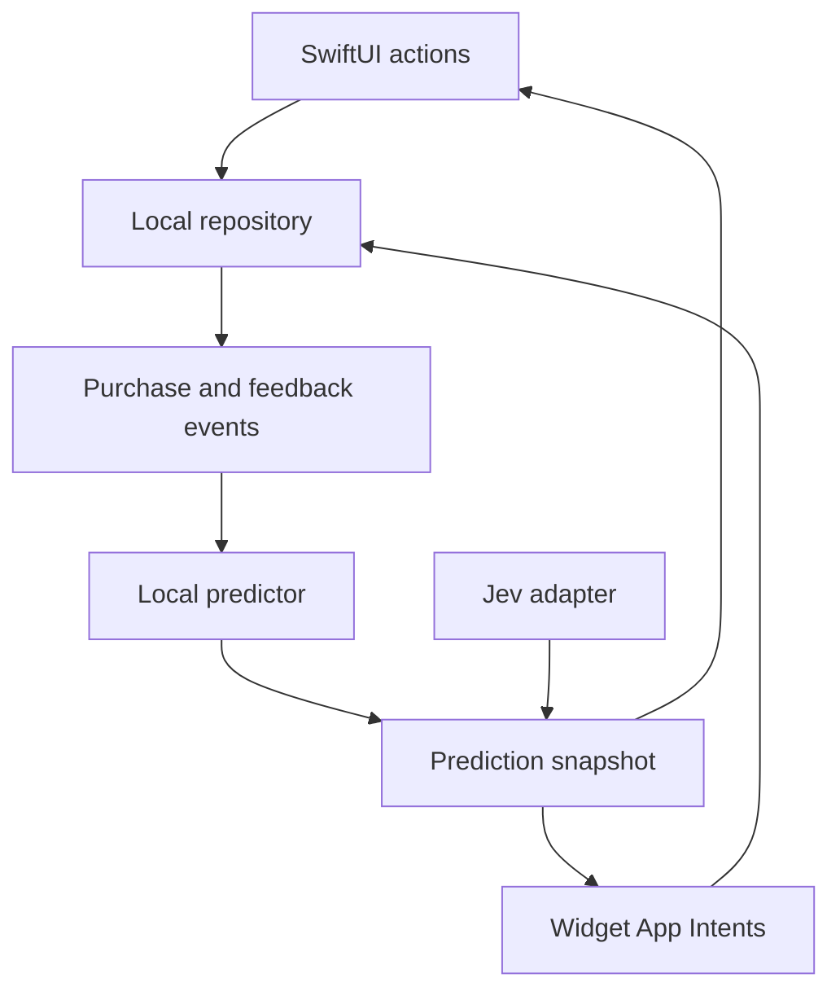

# Architecture sketch

## Targets and modules

- **iPhone app:** SwiftUI views and actions.
- **Shared core:** domain models, repository protocol, prediction engine, event corrections, widget snapshot builder.
- **Widget extension:** reads a small shared snapshot and invokes App Intents to write actions through shared storage.
- **Jev adapter:** optional HTTP client behind a protocol; deterministic prediction remains the offline path.

Target iOS 27. Keep a local store as the responsive source for app actions and use an App Group shared container for widget access. Choose SwiftData versus a small SQLite/store implementation after testing extension reads and App Intent writes on a device. Avoid assuming the widget can directly share an app process or live bindings. Use CloudKit for personal device sync and household sharing; the exact split between private-database sync and shared records must preserve one list across the user's and wife's separate Apple Accounts.

## Event-oriented domain

| Entity | Key fields | Purpose |
| --- | --- | --- |
| Product | stable ID, display name, normalized name, default quantity | Household identity and autocomplete |
| ListEntry | ID, product ID, quantity, origin, createdAt, status | Active user-owned shopping intent |
| PurchaseEvent | ID, product ID, quantity, purchasedAt, source entry ID | Immutable-ish learning signal; corrections remain possible |
| SuggestionFeedback | ID, product ID, action, timestamp, snoozeUntil | Accept/defer/dismiss outcome |
| PredictionSnapshot | product ID, score, tier, quantity, generatedAt, source | Derived cache for app and widget; never source of truth |

Use stable identifiers and explicit timestamps. For a mistaken check-off, reverse or delete the corresponding event and restore the list entry; rederive predictions. Avoid merging separate purchases on the same day without an explicit rule. Make actions idempotent by event ID so widget and app interactions cannot double record.

## Data flow

The diagram describes logical flow, not direct synchronous calls across processes. Persist a widget-readable snapshot in the App Group and request a timeline reload after changes. Refresh predictions when app opens, after purchase/feedback changes and at a conservative scheduled interval; widgets display the most recent safe snapshot.

## Personal iCloud sync

### Personal device sync

Sync Products, ListEntries, PurchaseEvents and SuggestionFeedback across the user's iPhone and iPad. Use stable record IDs, idempotent writes, explicit tombstones/corrections, and a clear conflict rule; keep prediction snapshots derived and regenerate them locally. The local store remains usable without an iCloud account or network, with pending edits retained until sync resumes. Handle account changes and recoverable sync failures without discarding local data.

### Household sharing

The user's wife has a separate Apple Account and must see and edit the same household list. Use CloudKit sharing (for example CKShare) with an invite/accept flow, participant access in the shared database, and a defined owner/participant model. Specify how the owner's iPhone and iPad see the shared household data alongside personal CloudKit sync; avoid creating divergent copies of the list. Validate invite acceptance, initial sync, offline add/check-off/undo on both accounts, reconnect convergence, and owner revocation/recovery. Enabling the iCloud capability and testing signed CloudKit access requires an active Apple Developer Program membership with admin access. No personal purchase data or Jev key goes in git.

The household share with the wife's separate Apple Account is required for personal v1; retain issue #8 as a core branch. Additional household members and more complex permission management can wait.
