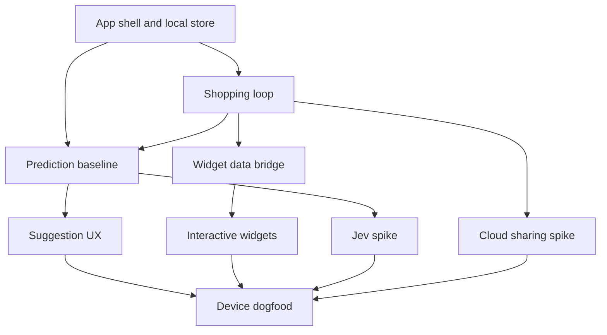

# v1 issue DAG

Each node is a GitHub issue. `Depends on` uses issue numbers once created; this file mirrors their order and intent. Independent branches can move in parallel, but personal-use speed matters more than a ceremony-heavy process.

The sharing spike can be deferred if it slows the first personal device build. The Jev spike is an optional enhancement with a working local fallback. “Done” means the acceptance checks in the issue work on device, not that every edge case is polished.
