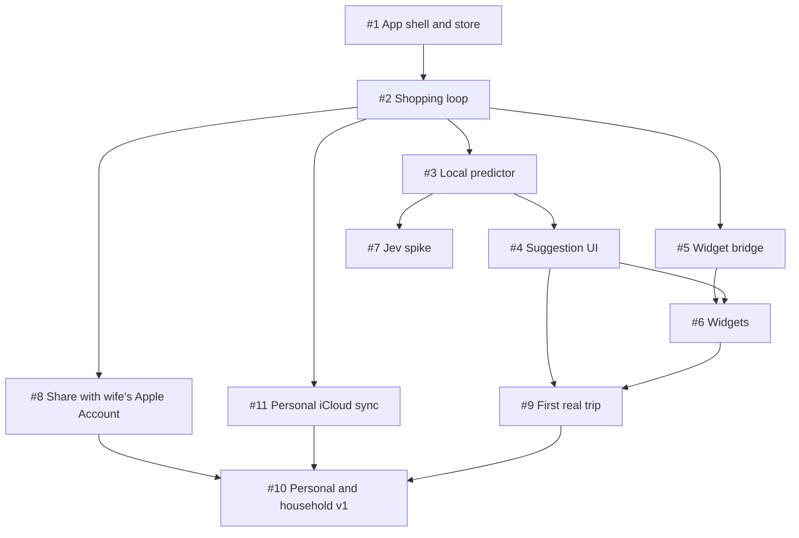

# v1 issue DAG

Each node is a GitHub issue. The `Depends on` lines are the directed edges. Independent branches can move in parallel, but personal-use speed matters more than a ceremony-heavy process.

| Issue | Depends on | Result |
| --- | --- | --- |
| [#1](https://github.com/Chaimalov/probably-groceries/issues/1) | — | App shell, local domain store |
| [#2](https://github.com/Chaimalov/probably-groceries/issues/2) | #1 | Shopping and purchase loop |
| [#3](https://github.com/Chaimalov/probably-groceries/issues/3) | #1, #2 | Offline prediction |
| [#4](https://github.com/Chaimalov/probably-groceries/issues/4) | #2, #3 | Suggestion UI and feedback |
| [#5](https://github.com/Chaimalov/probably-groceries/issues/5) | #1, #2 | Widget data bridge |
| [#6](https://github.com/Chaimalov/probably-groceries/issues/6) | #4, #5 | Interactive widgets |
| [#7](https://github.com/Chaimalov/probably-groceries/issues/7) | #3 | Jev spike with fallback |
| [#8](https://github.com/Chaimalov/probably-groceries/issues/8) | #1, #2 | Share the household list with the wife's separate Apple Account |
| [#9](https://github.com/Chaimalov/probably-groceries/issues/9) | #4, #6 | First genuine shopping trip |
| [#10](https://github.com/Chaimalov/probably-groceries/issues/10) | #8, #9, #11 | Validate personal device sync and shared household use |
| [#11](https://github.com/Chaimalov/probably-groceries/issues/11) | #1, #2 | Private CloudKit sync across devices signed into the same Apple Account; target iOS 27 |

Issue #8 is required because the list is shared with the user's wife; issue #7 (Jev) remains optional. iOS 27 requires Xcode 27 in CI. CloudKit capability setup and signed end-to-end sync testing depend on active Apple Developer Program access; implementation and local/offline behavior can proceed before that account step. “Done” means the acceptance checks in the issue work on device, not that every edge case is polished.
